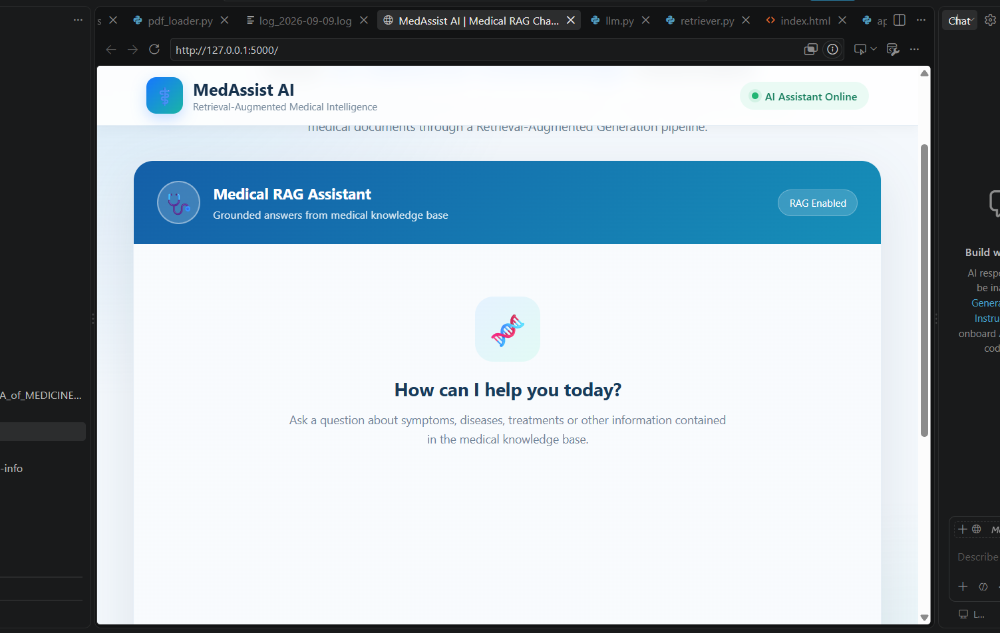
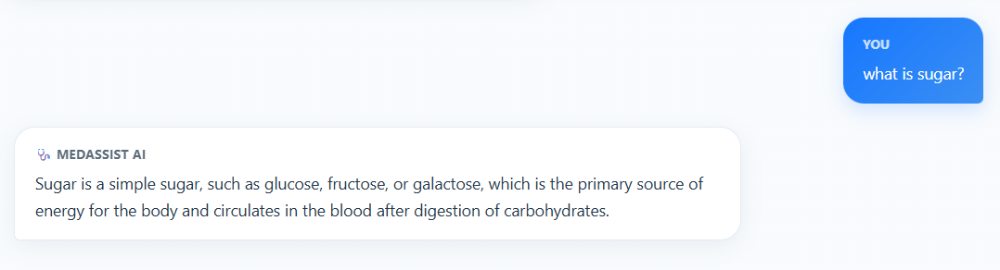
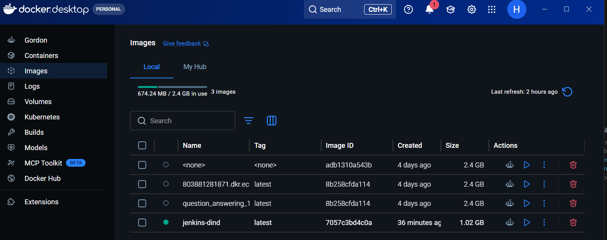
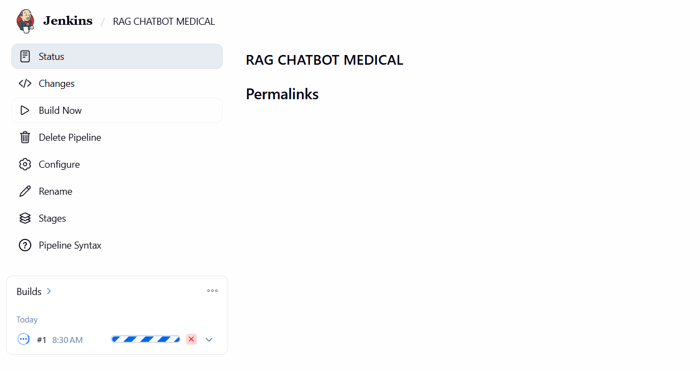
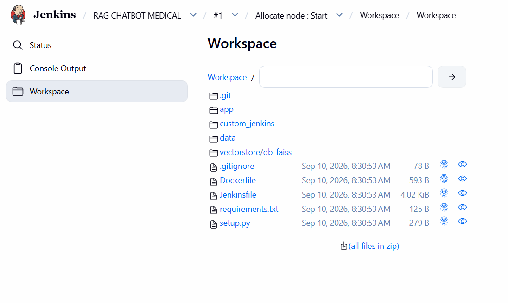
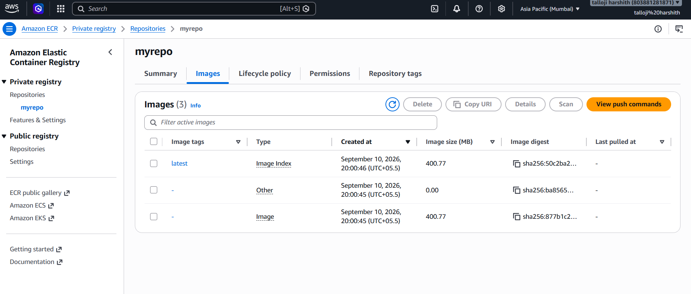
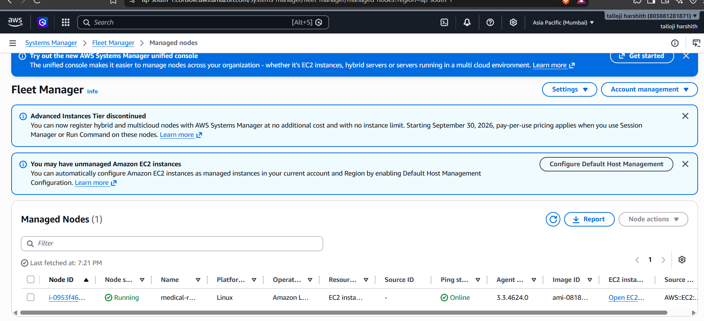

**# 🩺 Medical RAG Chatbot**

An end-to-end ****Retrieval-Augmented Generation (RAG) Medical Chatbot**** that retrieves relevant information from medical documents and generates context-aware answers using a Large Language Model.

The project also implements an end-to-end deployment pipeline using ****Docker, Jenkins, Trivy, AWS ECR, AWS Systems Manager (SSM), and Amazon EC2****.

> ⚠️ ****Disclaimer:**** This project is intended for educational and demonstration purposes only. It should not be used as a substitute for professional medical advice.

**---**

**## 📌 Project Overview**

Large Language Models can sometimes generate inaccurate or hallucinated responses because they rely primarily on knowledge learned during training.

This project uses ****Retrieval-Augmented Generation (RAG)**** to improve the grounding of responses.

Instead of directly sending a user's question to the LLM, the system:

1\. Searches a medical knowledge base.

2\. Retrieves the most relevant medical information.

3\. Adds the retrieved information to the prompt.

4\. Sends the augmented prompt to the LLM.

5\. Generates a context-aware response.

The application includes:

- Medical PDF ingestion

- Text chunking

- Sentence-transformer embeddings

- FAISS vector storage

- Semantic similarity search

- Retrieval-Augmented Generation

- Hugging Face LLM inference

- Flask web interface

- Docker containerization

- Jenkins CI/CD pipeline

- Trivy vulnerability scanning

- Amazon ECR container registry

- Amazon EC2 deployment

- AWS Systems Manager based automated deployment

**---**

**# 🏗️ System Architecture**

The project consists of two major workflows:

1\. ****RAG inference pipeline**** – responsible for retrieving medical knowledge and generating answers.

2\. ****CI/CD deployment pipeline**** – responsible for building, scanning, storing, and deploying the application.

**---**

**## 🧠 Medical RAG Architecture**

\`\`\`mermaid

flowchart LR

    A["📄 Medical PDF Documents"] --> B["📖 PyPDFLoader"]

    B --> C["✂️ RecursiveCharacterTextSplitter\<br/>Chunk Size: 500\<br/>Overlap: 50"]

    C --> D["📝 Text Chunks"]

    D --> E["🧠 Sentence Transformer\<br/>all-MiniLM-L6-v2"]

    E --> F[("🗄️ FAISS Vector Store")]

    U["👤 User Question"] --> G["🔢 Query Embedding"]

    G --> F

    F --> H["🔍 Similarity Search\<br/>Top K = 3"]

    H --> I["📚 Retrieved Medical Context"]

    U --> J["📝 Prompt Construction"]

    I --> J

    J --> K["🤖 Qwen3-4B-Instruct\<br/>LLM"]

    K --> L["💬 Context-Aware Answer"]

    L --> M["🌐 Flask Web Interface"]

\`\`\`

**### How the RAG Pipeline Works**

The medical documents are first loaded using ****PyPDFLoader****.

The documents are then divided into smaller pieces using \`RecursiveCharacterTextSplitter\` with:

\`\`\`text

Chunk Size    : 500

Chunk Overlap : 50

\`\`\`

Each text chunk is converted into a numerical representation using:

\`\`\`text

sentence-transformers/all-MiniLM-L6-v2

\`\`\`

These embeddings are stored inside the ****FAISS vector database****.

When the user asks a question:

\`\`\`text

User Question

      ↓

Question Embedding

      ↓

FAISS Similarity Search

      ↓

Top 3 Relevant Chunks

      ↓

Retrieved Context + Question

      ↓

Qwen LLM

      ↓

Final Answer

\`\`\`

This allows the LLM to generate an answer based on retrieved medical information rather than relying only on its pretrained knowledge.

**---**

**# ☁️ CI/CD Architecture**

\`\`\`mermaid

flowchart TD

    DEV["👨‍💻 Developer"] -->|"git push"| GH["📦 GitHub Repository"]

    GH --> J["⚙️ Jenkins Pipeline"]

    J --> BUILD["🐳 Build Docker Image"]

    BUILD --> TRIVY["🛡️ Trivy\<br/>Vulnerability Scan"]

    TRIVY --> ECR[("☁️ Amazon ECR\<br/>Container Registry")]

    ECR --> SSM["🔄 AWS Systems Manager\<br/>Run Command"]

    SSM --> EC2["🖥️ Amazon EC2\<br/>Amazon Linux 2023"]

    EC2 --> PULL["⬇️ Pull Latest\<br/>Docker Image"]

    PULL --> OLD["🗑️ Stop & Remove\<br/>Previous Container"]

    OLD --> RUN["🚀 Start New\<br/>Docker Container"]

    ENV["🔐 Protected Environment File\<br/>HF_TOKEN\<br/>FLASK_SECRET_KEY"] --> RUN

    RUN --> APP["🩺 Medical RAG Chatbot"]

    USER["👤 End User"] -->|"HTTP : 80"| APP

\`\`\`

**## 🔄 CI/CD Workflow**

The deployment pipeline follows this sequence:

\`\`\`text

Developer

    │

    │ git push

    ▼

GitHub Repository

    │

    ▼

Jenkins

    │

    ├── Checkout Source Code

    │

    ├── Build Docker Image

    │

    ├── Scan Image with Trivy

    │

    └── Push Image

    ▼

Amazon ECR

    │

    ▼

AWS Systems Manager

    │

    ▼

Amazon EC2

    │

    ├── Pull Latest Docker Image

    ├── Stop Previous Container

    ├── Remove Previous Container

    └── Start Updated Container

    │

    ▼

Medical RAG Chatbot

\`\`\`

Jenkins uses ****AWS Systems Manager Run Command**** to deploy the application to EC2.

This means Jenkins does not need to manually SSH into the EC2 instance during deployment.

**---**

**# 🔐 Cloud Security Architecture**

\`\`\`mermaid

flowchart LR

    J["⚙️ Jenkins"] --> IAM["🔑 Jenkins IAM User"]

    IAM -->|"Push Image"| ECR[("Amazon ECR")]

    IAM -->|"Restricted SSM Permission"| SSM["AWS Systems Manager"]

    SSM -->|"Run Command"| EC2["🖥️ EC2 Instance"]

    ROLE["🛡️ EC2 IAM Role"] -->|"ECR Read Only"| ECR

    ROLE -->|"SSM Managed Instance Core"| SSM

    ROLE --> EC2

    SECRET["🔐 Protected Runtime Secrets\<br/>.medical-rag.env\<br/>chmod 600"] --> EC2

    INTERNET["🌍 Internet Users"] -->|"HTTP Port 80"| EC2

    ADMIN["👨‍💻 Administrator"] -->|"SSH Port 22\<br/>Restricted IP"| EC2

\`\`\`

**## 🔒 Security Practices**

The project follows several cloud and application security practices:

- Hugging Face tokens are stored as environment variables.

- \`.env\` files are excluded from Git.

- Secrets are not hardcoded inside the application.

- Secrets are not embedded inside the Docker image.

- EC2 uses an ****IAM role**** instead of static AWS credentials.

- EC2 has ****read-only access to ECR****.

- EC2 communicates with AWS Systems Manager using \`AmazonSSMManagedInstanceCore\`.

- Jenkins uses restricted SSM permissions for deployment.

- Docker images are scanned using ****Trivy****.

- Application port \`5000\` is not exposed directly to the public internet.

- Public traffic reaches the application through ****port 80****.

- SSH port \`22\` is restricted to the administrator's IP.

- Runtime secrets are stored in a protected EC2 environment file.

**---**

**# 🛠️ Technology Stack**

| Category | Technology |

|---|---|

| Programming Language | Python |

| Web Framework | Flask |

| RAG Framework | LangChain |

| Document Loader | PyPDFLoader |

| Text Splitting | RecursiveCharacterTextSplitter |

| Embedding Model | all-MiniLM-L6-v2 |

| Vector Database | FAISS |

| Large Language Model | Qwen/Qwen3-4B-Instruct-2507 |

| Model Platform | Hugging Face |

| Containerization | Docker |

| CI/CD | Jenkins |

| Security Scanning | Trivy |

| Container Registry | Amazon ECR |

| Cloud Compute | Amazon EC2 |

| Remote Deployment | AWS Systems Manager |

| Cloud Platform | AWS |

**---**

**# 📂 Project Structure**

\`\`\`text

RAG-MEDICAL-CHATBOT/

│

├── app/

│   ├── application.py

│   ├── common/

│   ├── components/

│   ├── config/

│   └── templates/

│

├── custom_jenkins/

│

├── data/

│

├── vectorstore/

│   └── db_faiss/

│

├── Dockerfile

├── Jenkinsfile

├── requirements.txt

├── setup.py

├── .gitignore

├── .dockerignore

└── README.md

\`\`\`

**---**

**# 🔍 RAG Components**

**## 1️⃣ Document Loading**

Medical PDF documents are loaded using:

\`\`\`text

PyPDFLoader

\`\`\`

The loader extracts text from the medical documents so that it can be processed by the RAG pipeline.

**---**

**## 2️⃣ Text Chunking**

Large documents cannot be efficiently retrieved as one large block.

Therefore, the documents are divided using:

\`\`\`text

RecursiveCharacterTextSplitter

\`\`\`

Configuration:

\`\`\`text

Chunk Size    = 500

Chunk Overlap = 50

\`\`\`

The overlap helps preserve context between neighboring chunks.

**---**

**## 3️⃣ Embedding Generation**

Each chunk is converted into a dense vector using:

\`\`\`text

sentence-transformers/all-MiniLM-L6-v2

\`\`\`

The embedding model converts semantically similar text into vectors that are close to each other in vector space.

**---**

**## 4️⃣ FAISS Vector Database**

The generated embeddings are stored in:

\`\`\`text

FAISS

\`\`\`

FAISS enables efficient similarity search over the embedded medical documents.

**---**

**## 5️⃣ Retriever**

When the user enters a question, the question is converted into an embedding.

FAISS compares the query embedding with the stored document embeddings.

The retriever returns:

\`\`\`text

Top K = 3

\`\`\`

most relevant document chunks.

**---**

**## 6️⃣ Prompt Augmentation**

The retrieved chunks are combined with the user's question.

Conceptually:

\`\`\`text

Retrieved Medical Context

            +

       User Question

            ↓

       Final Prompt

\`\`\`

The prompt instructs the model to answer using the supplied context.

**---**

**## 7️⃣ LLM Response Generation**

The augmented prompt is passed to:

\`\`\`text

Qwen/Qwen3-4B-Instruct-2507

\`\`\`

through Hugging Face inference.

The LLM then generates the final response.

**---**

**# 🌐 Flask Web Application**

Flask provides the user-facing chatbot interface.

The application:

- Receives the user's question.

- Sends the question to the RAG pipeline.

- Retrieves relevant medical context.

- Generates an LLM response.

- Displays the response in the chatbot interface.

- Maintains the conversation messages in the session.

The application listens internally on:

\`\`\`text

5000

\`\`\`

On EC2, Docker maps:

\`\`\`text

Host Port 80 → Container Port 5000

\`\`\`

Therefore, users access the chatbot using standard HTTP port \`80\`.

**---**

**# 💻 Running the Project Locally**

**## 1. Clone Repository**

\`\`\`bash

git clone https://github.com/tallojarshith/RAG-MEDICAL-CHATBOT.git

cd RAG-MEDICAL-CHATBOT

\`\`\`

**---**

**## 2. Create Conda Environment**

\`\`\`bash

conda create -n medi python=3.10 -y

conda activate medi

\`\`\`

**---**

**## 3. Install Dependencies**

\`\`\`bash

pip install -r requirements.txt

\`\`\`

**---**

**## 4. Configure Environment Variables**

Create a \`.env\` file in the project root.

\`\`\`text

HF_TOKEN=your_huggingface_token

FLASK_SECRET_KEY=your_flask_secret_key

\`\`\`

> Never commit this file to GitHub.

**---**

**## 5. Run Application**

\`\`\`bash

python -m app.application

\`\`\`

The application runs locally on:

\`\`\`text

http://localhost:5000

\`\`\`

**---**

**# 🐳 Docker Containerization**

The complete application is packaged into a Docker image.

**## Build**

\`\`\`bash

docker build -t medical-rag-chatbot .

\`\`\`

**## Run**

\`\`\`bash

docker run \\

  --name medical-rag-chatbot \\

  --env-file .env \\

  -p 5000:5000 \\

  medical-rag-chatbot

\`\`\`

The Docker configuration uses ****CPU-only PyTorch**** to avoid unnecessary GPU libraries and reduce image size.

A \`.dockerignore\` file prevents unnecessary files such as the virtual environment, Git metadata, logs, IDE files, and secrets from entering the Docker build context.

**---**

**# ⚙️ Jenkins CI/CD Pipeline**

The Jenkins pipeline automates the build and deployment lifecycle.

**## Pipeline Stages**

\`\`\`text

Stage 1 → Clone GitHub Repository

Stage 2 → Build Docker Image

Stage 3 → Scan Docker Image with Trivy

Stage 4 → Push Docker Image to Amazon ECR

Stage 5 → Deploy to Amazon EC2 using AWS SSM

\`\`\`

**### Deployment Process**

During the deployment stage, Jenkins sends an SSM Run Command to the EC2 instance.

The EC2 instance then:

\`\`\`text

Authenticates with ECR

        ↓

Pulls latest Docker image

        ↓

Stops existing container

        ↓

Removes existing container

        ↓

Starts new container

        ↓

Application becomes available on port 80

\`\`\`

**---**

**# 🛡️ Trivy Vulnerability Scanning**

Before deployment, Jenkins scans the Docker image using ****Trivy****.

The scan checks for:

\`\`\`text

HIGH

CRITICAL

\`\`\`

severity vulnerabilities.

The report is generated as:

\`\`\`text

trivy-report.json

\`\`\`

and archived by Jenkins.

This adds a security scanning stage to the CI/CD workflow.

**---**

**# ☁️ AWS Deployment**

**## Amazon ECR**

Amazon Elastic Container Registry stores the Docker image generated by Jenkins.

\`\`\`text

Jenkins

   ↓

Docker Image

   ↓

Amazon ECR

\`\`\`

EC2 receives read-only access to the repository through its IAM role.

**---**

**## Amazon EC2**

The application is hosted on an Amazon Linux EC2 instance.

The Docker container is configured with:

\`\`\`text

--restart unless-stopped

\`\`\`

so the application container can automatically restart after an instance or Docker restart.

The deployment maps:

\`\`\`text

EC2 Port 80

      ↓

Docker Container Port 5000

      ↓

Flask Application

\`\`\`

**---**

**## AWS Systems Manager**

AWS Systems Manager enables Jenkins to remotely deploy the application without storing SSH keys inside the Jenkins pipeline.

\`\`\`text

Jenkins

    ↓

SSM SendCommand

    ↓

EC2 SSM Agent

    ↓

Deployment Commands

    ↓

Docker Pull + Run

\`\`\`

This provides a cleaner deployment mechanism than direct SSH-based deployment.

**---**

**# 🧩 Major Challenges & Solutions**

**## 1. LangChain Package Migration**

**### Problem**

Newer LangChain versions moved several modules into separate packages.

Old imports resulted in errors such as:

\`\`\`text

ModuleNotFoundError: langchain.text_splitter

\`\`\`

**### Solution**

The project was migrated to:

\`\`\`python

from langchain_text_splitters import RecursiveCharacterTextSplitter

\`\`\`

and retrieval-chain functionality compatible with the installed LangChain ecosystem.

**---**

**## 2. Hugging Face Model Compatibility**

**### Problem**

Some Hugging Face models were not supported by the enabled inference providers or expected a different task type.

**### Solution**

Multiple compatible models were evaluated and the project ultimately used:

\`\`\`text

Qwen/Qwen3-4B-Instruct-2507

\`\`\`

**---**

**## 3. Large Docker Build**

**### Problem**

The initial Docker build downloaded large GPU-related PyTorch dependencies, including Triton.

This increased build time and image size.

**### Solution**

CPU-only PyTorch was installed using the official CPU wheel repository.

This avoided unnecessary GPU dependencies.

**---**

**## 4. Huge Docker Build Context**

**### Problem**

The local Python environment and other development files were entering the Docker build context.

At one stage, the build context was approximately:

\`\`\`text

1.17 GB

\`\`\`

**### Solution**

A \`.dockerignore\` file was introduced.

The resulting build context was reduced dramatically to only the files required for the application.

**---**

**## 5. Python Import Error Inside Docker**

**### Problem**

Starting the application with:

\`\`\`text

python app/application.py

\`\`\`

caused Python package-resolution problems inside the container.

**### Solution**

The Docker startup command was changed to:

\`\`\`text

python -m app.application

\`\`\`

This runs the application as a Python module and preserves the correct package import path.

**---**

**## 6. ECR Push Timeouts**

**### Problem**

Uploading large Docker layers to Amazon ECR resulted in network timeout errors.

**### Solution**

The Docker image was optimized and concurrent Docker uploads were reduced.

Layer caching also helped subsequent deployments.

**---**

**## 7. EC2 Resource Constraints**

**### Problem**

The selected EC2 instance had limited memory for the application workload.

**### Solution**

A swap file was configured on EC2 to provide additional virtual memory and reduce the chance of out-of-memory failures.

**---**

**## 8. EC2 ECR Authentication**

**### Problem**

Initially, EC2 could not authenticate with ECR because AWS credentials were unavailable.

**### Solution**

Instead of storing AWS access keys on EC2, an IAM role was attached with:

\`\`\`text

AmazonEC2ContainerRegistryReadOnly

\`\`\`

This allows the instance to pull images securely.

**---**

**## 9. Automated EC2 Deployment**

**### Problem**

Manually connecting to EC2 for every deployment would make the deployment process inefficient.

**### Solution**

AWS Systems Manager was integrated with Jenkins.

Jenkins now sends deployment commands through SSM, and EC2 automatically pulls and runs the newest Docker image.

**---**

**## 10. EC2 Network Debugging**

During deployment, the application initially could not be reached from the browser.

The following components were verified:

\`\`\`text

Security Group

Network ACL

Route Table

Internet Gateway

Elastic Network Interface

Docker Port Mapping

iptables

EC2 Reachability Analyzer

HTTP connectivity

\`\`\`

The final deployment exposes:

\`\`\`text

Internet

   ↓

EC2 Port 80

   ↓

Docker Port 5000

   ↓

Flask Application

\`\`\`

**---**

**# 📊 Key Engineering Improvements**

During development, several optimizations were made:

\`\`\`text

Docker Build Context

\~1.17 GB

      ↓

.dockerignore

      ↓

A few KB of required build context

\`\`\`

and:

\`\`\`text

Initial Docker Setup

Large GPU Dependencies

      ↓

CPU-only PyTorch

      ↓

Smaller and Faster Container Build

\`\`\`

The project also evolved from:

\`\`\`text

Manual Deployment

      ↓

Docker Deployment

      ↓

Jenkins CI

      ↓

ECR

      ↓

SSM Automated EC2 Deployment

\`\`\`

**---**

**# 🎯 Key Learning Outcomes**

This project demonstrates practical experience with:

- Retrieval-Augmented Generation

- Document ingestion

- Text chunking

- Embedding models

- Semantic search

- Vector databases

- FAISS

- LangChain

- Hugging Face inference

- Large Language Models

- Prompt engineering

- Flask

- Docker

- Jenkins

- CI/CD

- Trivy

- AWS IAM

- Amazon ECR

- Amazon EC2

- AWS Systems Manager

- Linux

- Cloud networking

- Security groups

- Container deployment

- Cloud debugging

**---**

**# Project Screenshots

The screenshots below document the Medical RAG Chatbot from local RAG
development through Docker, Jenkins CI/CD, Amazon ECR, EC2 deployment,
AWS Systems Manager, and the final live application.

> **Note:** The screenshots are grouped by engineering stage so the
> README remains easy to review. Each section can be expanded on GitHub.

## 1. RAG Pipeline and Local Application

```{=html}
<details open>
```
```{=html}
<summary>
```
`<b>`{=html}View RAG development and local chatbot
screenshots`</b>`{=html}
```{=html}
</summary>
```
### FAISS vector-store creation and application logs


### Local MedAssist AI interface



### Context-grounded medical response


### Out-of-context guardrail behavior

The assistant refuses to invent an answer when the required information
is not present in the supplied medical documents.


### Additional medical query



### FAISS and Flask runtime logs


```{=html}
</details>
```
## 2. Docker Containerization

```{=html}
<details>
```
```{=html}
<summary>
```
`<b>`{=html}View Docker screenshots`</b>`{=html}
```{=html}
</summary>
```
### Docker images during development



```{=html}
</details>
```
## 3. Jenkins CI Setup

```{=html}
<details>
```
```{=html}
<summary>
```
`<b>`{=html}View Jenkins setup screenshots`</b>`{=html}
```{=html}
</summary>
```
### Initial Jenkins unlock


### Jenkins plugin installation


### GitHub credential configured in Jenkins


### Medical RAG Jenkins pipeline job



### Successful GitHub checkout


### Successful Jenkins build


### Jenkins workspace



### Jenkins plugin downloads


### Dependency/build logs


```{=html}
</details>
```
## 4. Amazon ECR and EC2 Deployment

```{=html}
<details>
```
```{=html}
<summary>
```
`<b>`{=html}View AWS deployment screenshots`</b>`{=html}
```{=html}
</summary>
```
### Docker image stored in Amazon ECR



### EC2 pulling and running the Docker image


### Application running from EC2


### Live medical RAG response on EC2


### Multiple live RAG responses


```{=html}
</details>
```
## 5. AWS Systems Manager and Automated Deployment

```{=html}
<details>
```
```{=html}
<summary>
```
`<b>`{=html}View SSM/CD screenshots`</b>`{=html}
```{=html}
</summary>
```
### EC2 registered as an SSM managed node



### Jenkins-to-EC2 SSM command succeeded


```{=html}
</details>
```
## 6. Final Live Medical RAG Chatbot

```{=html}
<details open>
```
```{=html}
<summary>
```
`<b>`{=html}View final application`</b>`{=html}
```{=html}
</summary>
```


```{=html}
</details>
```

------------------------------------------------------------------------

## Screenshot Journey at a Glance

**RAG development → FAISS retrieval → Flask UI → Docker → Jenkins →
Amazon ECR → EC2 → AWS SSM → Live Medical RAG Chatbot**

These screenshots demonstrate both the AI workflow and the deployment
engineering completed for the project.

---

# 🚀 Future Improvements**

Potential improvements include:

- Replace the Flask development server with ****Gunicorn****.

- Configure a custom domain.

- Add ****HTTPS/TLS****.

- Introduce an Application Load Balancer.

- Add automated unit and integration tests.

- Make Trivy fail the pipeline for selected critical vulnerabilities.

- Add Prometheus and Grafana monitoring.

- Add source citations to chatbot responses.

- Introduce document reranking.

- Implement hybrid semantic + keyword search.

- Add RAG evaluation metrics.

- Add conversation-aware retrieval.

- Add health-check endpoints.

- Use immutable Docker image tags instead of only \`latest\`.

- Add automated rollback if deployment fails.

**---**

**# ⚠️ Medical Disclaimer**

This chatbot is an educational RAG application.

The generated responses:

- Should not be interpreted as medical diagnosis.

- Should not replace consultation with a qualified healthcare professional.

- Depend on the medical documents available in the knowledge base.

- May still contain errors despite retrieval grounding.

**---**

**# 👨‍💻 Author**

****Talloj Harshith****

M.Tech Data Science  

SVNIT Surat

**---**

**## ⭐ Project Summary**

This project demonstrates an end-to-end implementation of:

\`\`\`text

Medical Documents

       ↓

RAG Pipeline

       ↓

FAISS Retrieval

       ↓

Qwen LLM

       ↓

Flask Application

       ↓

Docker

       ↓

Jenkins

       ↓

Trivy

       ↓

Amazon ECR

       ↓

AWS Systems Manager

       ↓

Amazon EC2

       ↓

Live Medical RAG Chatbot

\`\`\`