# 🩺 Medical RAG Chatbot

An end-to-end **Retrieval-Augmented Generation (RAG) Medical Chatbot** that retrieves relevant information from medical documents and generates context-aware answers using a Large Language Model.

The project also implements an end-to-end deployment pipeline using **Docker, Jenkins, Trivy, AWS ECR, AWS Systems Manager (SSM), and Amazon EC2**.

> ⚠️ **Disclaimer:** This project is intended for educational and demonstration purposes only. It should not be used as a substitute for professional medical advice.

---

## 📌 Project Overview

Large Language Models can sometimes generate inaccurate or hallucinated responses because they rely primarily on knowledge learned during training.

This project uses **Retrieval-Augmented Generation (RAG)** to improve the grounding of responses.

Instead of directly sending a user's question to the LLM, the system:

1. Searches a medical knowledge base.
2. Retrieves the most relevant medical information.
3. Adds the retrieved information to the prompt.
4. Sends the augmented prompt to the LLM.
5. Generates a context-aware response.

### Key Features

- Medical PDF ingestion
- Intelligent text chunking
- Sentence-transformer embeddings
- FAISS vector storage
- Semantic similarity search
- Retrieval-Augmented Generation
- Hugging Face LLM inference
- Flask chatbot interface
- Docker containerization
- Jenkins CI/CD
- Trivy vulnerability scanning
- Amazon ECR container registry
- Amazon EC2 deployment
- AWS Systems Manager based automated deployment
- Runtime secret management
- IAM-based AWS authentication

---

# 🏗️ System Architecture

The project consists of two major workflows:

1. **RAG inference pipeline** — retrieves medical knowledge and generates answers.
2. **CI/CD deployment pipeline** — builds, scans, stores, and deploys the application.

---

## 🧠 Medical RAG Architecture

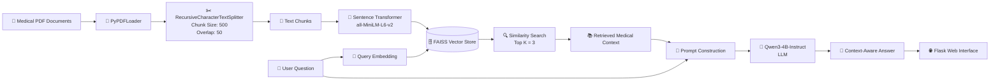

### How the RAG Pipeline Works

Medical documents are first loaded using **PyPDFLoader**.

The documents are divided into smaller chunks using `RecursiveCharacterTextSplitter`:

```text
Chunk Size    : 500
Chunk Overlap : 50
```

Each chunk is converted into a numerical vector using:

```text
sentence-transformers/all-MiniLM-L6-v2
```

The embeddings are stored inside **FAISS**.

When a user asks a question:

```text
User Question
      ↓
Query Embedding
      ↓
FAISS Similarity Search
      ↓
Top 3 Relevant Chunks
      ↓
Retrieved Context + Question
      ↓
Qwen LLM
      ↓
Context-Aware Answer
```

This allows the model to answer using retrieved medical information instead of depending only on its pretrained knowledge.

---

# ☁️ CI/CD Architecture

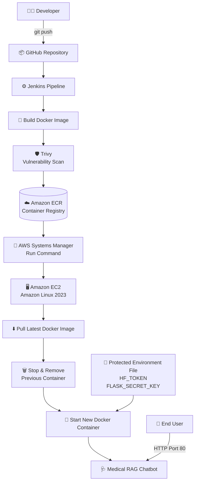

## 🔄 CI/CD Workflow

```text
Developer
    │
    ▼
GitHub Repository
    │
    ▼
Jenkins
    │
    ├── Checkout Source Code
    ├── Build Docker Image
    ├── Scan Image with Trivy
    └── Push Docker Image
    │
    ▼
Amazon ECR
    │
    ▼
AWS Systems Manager
    │
    ▼
Amazon EC2
    │
    ├── Pull Latest Docker Image
    ├── Stop Previous Container
    ├── Remove Previous Container
    └── Start Updated Container
    │
    ▼
Medical RAG Chatbot
```

Jenkins uses **AWS Systems Manager Run Command** to deploy the application to EC2.

This removes the need for Jenkins to SSH directly into the EC2 instance during deployment.

> **Note:** The Jenkins pipeline automates build, scan, ECR push, and EC2 deployment once the Jenkins job is triggered.

---

# 🔐 Cloud Security Architecture

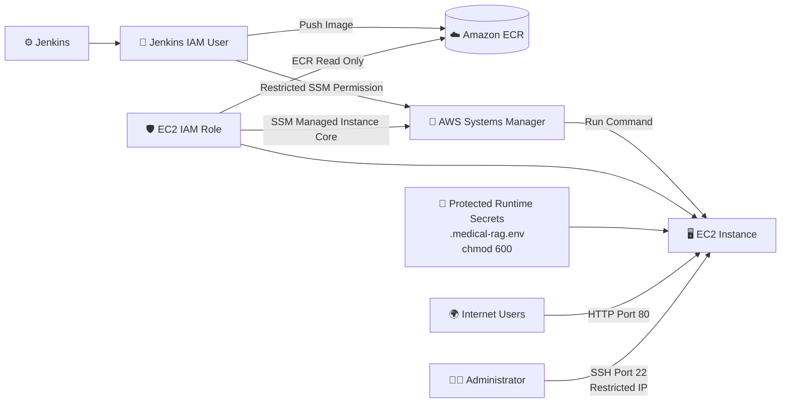

## 🔒 Security Practices

The project implements several security measures:

- Hugging Face tokens are stored as environment variables.
- `.env` files are excluded from Git.
- Secrets are not hardcoded in application source code.
- Secrets are not embedded inside the Docker image.
- EC2 uses an **IAM role** instead of static AWS credentials.
- EC2 receives **read-only access to Amazon ECR**.
- EC2 uses `AmazonSSMManagedInstanceCore`.
- Jenkins uses restricted SSM deployment permissions.
- Docker images are scanned using **Trivy**.
- Container port `5000` is not exposed publicly through the EC2 security group.
- Users access the application through HTTP port `80`.
- SSH port `22` is restricted to the administrator's IP.
- Runtime secrets are stored in a protected environment file.

---

# 🛠️ Technology Stack

| Category | Technology |
|---|---|
| Programming Language | Python |
| Web Framework | Flask |
| RAG Framework | LangChain |
| Document Loader | PyPDFLoader |
| Text Splitting | RecursiveCharacterTextSplitter |
| Embedding Model | all-MiniLM-L6-v2 |
| Vector Database | FAISS |
| Large Language Model | Qwen/Qwen3-4B-Instruct-2507 |
| Model Platform | Hugging Face |
| Containerization | Docker |
| CI/CD | Jenkins |
| Security Scanning | Trivy |
| Container Registry | Amazon ECR |
| Cloud Compute | Amazon EC2 |
| Remote Deployment | AWS Systems Manager |
| Cloud Platform | AWS |

---

# 📂 Project Structure

```text
RAG-MEDICAL-CHATBOT/
│
├── app/
│   ├── application.py
│   ├── common/
│   ├── components/
│   ├── config/
│   └── templates/
│
├── custom_jenkins/
│
├── data/
│
├── vectorstore/
│   └── db_faiss/
│
├── docs/
│   └── screenshots/
│
├── Dockerfile
├── Jenkinsfile
├── requirements.txt
├── setup.py
├── .gitignore
├── .dockerignore
└── README.md
```

---

# 🔍 RAG Components

## 1️⃣ Document Loading

Medical PDF documents are loaded using:

```text
PyPDFLoader
```

The loader extracts text from the medical documents so it can be processed by the RAG pipeline.

---

## 2️⃣ Text Chunking

Large documents are divided using:

```text
RecursiveCharacterTextSplitter
```

Configuration:

```text
Chunk Size    = 500
Chunk Overlap = 50
```

The overlap helps preserve context between neighboring chunks.

---

## 3️⃣ Embedding Generation

Each text chunk is converted into a dense vector using:

```text
sentence-transformers/all-MiniLM-L6-v2
```

The model generates **384-dimensional embeddings**.

Semantically similar pieces of text are represented by vectors located close to one another in vector space.

---

## 4️⃣ FAISS Vector Database

The generated embeddings are stored in:

```text
FAISS
```

FAISS enables efficient similarity search over the embedded medical documents.

---

## 5️⃣ Retriever

When a user enters a question, the same embedding model converts the question into a query vector.

FAISS compares this vector against the stored document vectors.

The retriever returns:

```text
Top K = 3
```

most relevant chunks.

---

## 6️⃣ Prompt Augmentation

The retrieved context is combined with the user's question:

```text
Retrieved Medical Context
            +
       User Question
            ↓
       Final Prompt
```

The prompt instructs the model to answer using the supplied context.

---

## 7️⃣ LLM Response Generation

The augmented prompt is passed to:

```text
Qwen/Qwen3-4B-Instruct-2507
```

through Hugging Face inference.

The model generates the final response using the retrieved context.

---

# 🌐 Flask Web Application

Flask provides the chatbot's web interface.

The application:

- Receives the user's question.
- Sends the question to the RAG pipeline.
- Retrieves relevant medical context.
- Generates an LLM response.
- Displays the response in the chatbot interface.
- Maintains conversation messages in the session.

The application listens internally on:

```text
5000
```

On EC2, Docker maps:

```text
Host Port 80 → Container Port 5000
```

Therefore users access the deployed chatbot using standard HTTP port `80`.

---

# 💻 Running Locally

## 1. Clone Repository

```bash
git clone https://github.com/tallojarshith/RAG-MEDICAL-CHATBOT.git
cd RAG-MEDICAL-CHATBOT
```

## 2. Create Conda Environment

```bash
conda create -n medi python=3.10 -y
conda activate medi
```

## 3. Install Dependencies

```bash
pip install -r requirements.txt
```

## 4. Configure Environment Variables

Create a `.env` file in the project root:

```text
HF_TOKEN=your_huggingface_token
FLASK_SECRET_KEY=your_flask_secret_key
```

> Never commit this file to GitHub.

## 5. Run Application

```bash
python -m app.application
```

The application runs locally at:

```text
http://localhost:5000
```

---

# 🐳 Docker Containerization

The complete application is packaged inside a Docker image.

## Build

```bash
docker build -t medical-rag-chatbot .
```

## Run

```bash
docker run \
  --name medical-rag-chatbot \
  --env-file .env \
  -p 5000:5000 \
  medical-rag-chatbot
```

The Docker configuration uses **CPU-only PyTorch** to avoid unnecessary GPU libraries.

A `.dockerignore` prevents unnecessary files such as the virtual environment, Git metadata, logs, IDE files, and secrets from entering the build context.

---

# ⚙️ Jenkins CI/CD Pipeline

The Jenkins pipeline automates the build and deployment lifecycle.

## Pipeline Stages

```text
Stage 1 → Checkout GitHub Repository

Stage 2 → Build Docker Image

Stage 3 → Scan Docker Image with Trivy

Stage 4 → Push Docker Image to Amazon ECR

Stage 5 → Deploy to Amazon EC2 using AWS SSM
```

## Deployment Process

During deployment, Jenkins sends an SSM Run Command to the EC2 instance.

EC2 then performs:

```text
Authenticate with ECR
        ↓
Pull Latest Docker Image
        ↓
Stop Existing Container
        ↓
Remove Existing Container
        ↓
Start New Container
        ↓
Application Available on Port 80
```

---

# 🛡️ Trivy Vulnerability Scanning

Before deployment, Jenkins scans the Docker image using **Trivy**.

The scan checks:

```text
HIGH
CRITICAL
```

severity vulnerabilities.

The generated report is stored as:

```text
trivy-report.json
```

and archived by Jenkins.

Currently the scan generates a security report. A future improvement is to configure selected vulnerability thresholds to fail the pipeline.

---

# ☁️ AWS Deployment

## Amazon ECR

Amazon Elastic Container Registry stores the Docker image generated by Jenkins.

```text
Jenkins
   ↓
Docker Image
   ↓
Amazon ECR
```

EC2 receives read-only access to ECR through its IAM role.

---

## Amazon EC2

The application runs inside Docker on an Amazon Linux EC2 instance.

The container uses:

```text
--restart unless-stopped
```

which allows it to restart automatically after Docker or EC2 restarts unless it was deliberately stopped.

Deployment mapping:

```text
Internet
   ↓
EC2 Port 80
   ↓
Docker Container Port 5000
   ↓
Flask Application
```

A **4 GiB swap file** was also configured because the selected EC2 instance has limited physical memory.

---

## AWS Systems Manager

AWS Systems Manager enables Jenkins to remotely deploy the application without storing EC2 SSH keys inside the Jenkins pipeline.

```text
Jenkins
    ↓
SSM SendCommand
    ↓
EC2 SSM Agent
    ↓
Deployment Commands
    ↓
Docker Pull + Run
```

The CD pipeline targets the **EC2 instance ID**, so deployment does not depend on the instance's public IPv4 address.

---

# 🧩 Major Challenges & Solutions

## 1. LangChain Package Migration

### Problem

Newer LangChain versions moved several components into separate packages.

Example error:

```text
ModuleNotFoundError: langchain.text_splitter
```

### Solution

Used:

```python
from langchain_text_splitters import RecursiveCharacterTextSplitter
```

and compatible retrieval-chain functionality through `langchain_classic`.

---

## 2. Missing Sentence Transformers

### Problem

The embedding model initially failed with:

```text
Could not import sentence_transformers
```

### Solution

Installed:

```bash
python -m pip install sentence-transformers
```

---

## 3. Hugging Face Provider Compatibility

### Problem

Some Hugging Face models were incompatible with the available inference provider or expected a different task type.

### Solution

Multiple models were evaluated.

The final working model was:

```text
Qwen/Qwen3-4B-Instruct-2507
```

---

## 4. Large Docker Dependencies

### Problem

The initial Docker build downloaded large GPU-related PyTorch dependencies, including Triton.

### Solution

CPU-only PyTorch was installed from the official CPU wheel repository.

This removed unnecessary GPU dependencies.

---

## 5. Huge Docker Build Context

### Problem

The virtual environment and other development files were entering the Docker build context.

At one point the context was approximately:

```text
1.17 GB
```

### Solution

A `.dockerignore` was introduced.

This dramatically reduced the build context and improved build speed.

---

## 6. Python Import Error Inside Docker

### Problem

Running:

```text
python app/application.py
```

inside Docker caused module-resolution problems.

### Solution

The Docker startup command was changed to:

```text
python -m app.application
```

---

## 7. Jenkins Docker Build Stage

### Problem

The pipeline attempted to tag:

```text
myrepo:latest
```

before the image had been built.

This resulted in:

```text
No such image: myrepo:latest
```

### Solution

A dedicated Docker build stage was added before tagging and pushing.

---

## 8. ECR Push Timeout

### Problem

Uploading large Docker layers to Amazon ECR resulted in network timeout errors.

### Solution

The image was optimized and Docker concurrent uploads were reduced.

Layer caching also improved subsequent builds.

---

## 9. EC2 ECR Authentication

### Problem

EC2 initially could not authenticate with ECR because AWS credentials were unavailable.

### Solution

An EC2 IAM role was attached with:

```text
AmazonEC2ContainerRegistryReadOnly
```

No permanent AWS access keys were required on EC2.

---

## 10. EC2 Memory Constraints

### Problem

The selected EC2 instance had limited RAM.

### Solution

A persistent **4 GiB swap file** was configured to provide additional virtual memory.

---

## 11. Public Network Debugging

### Problem

The application initially could not be reached from the browser.

### Investigation

The following were checked:

```text
Flask
Docker Port Mapping
Security Group
Network ACL
Route Table
Internet Gateway
Elastic Network Interface
iptables
EC2 Reachability Analyzer
tcpdump
External HTTP Request
```

### Solution

The application was mapped as:

```text
EC2 Port 80 → Docker Port 5000
```

External connectivity was confirmed with HTTP `200 OK`.

---

## 12. AWS Systems Manager Registration

### Problem

The EC2 instance initially did not appear as a managed SSM node.

### Solution

The EC2 IAM role was given:

```text
AmazonSSMManagedInstanceCore
```

The SSM agent was restarted and the instance successfully registered with Systems Manager.

---

## 13. Least-Privilege SSM Deployment

### Problem

`AmazonSSMFullAccess` was initially used while testing Jenkins-to-EC2 deployment.

### Solution

A restricted Jenkins SSM policy was created and tested.

After successful deployment, the broad SSM policy was removed.

---

# 📈 Engineering Improvements

## Docker Build Context

```text
~1.17 GB
    ↓
.dockerignore
    ↓
Only Required Build Files
```

## PyTorch Dependencies

```text
GPU-related Dependencies
        ↓
CPU-only PyTorch
        ↓
Smaller Docker Environment
```

## Deployment Evolution

```text
Manual Application
        ↓
Dockerized Application
        ↓
Jenkins CI
        ↓
Trivy Security Scan
        ↓
Amazon ECR
        ↓
AWS SSM Deployment
        ↓
Amazon EC2
```

---

# 📸 Project Screenshots

The screenshots below document the project from local RAG development through final AWS deployment.

---

## 1️⃣ RAG Pipeline & Local Application

<details open>
<summary><b>View RAG development screenshots</b></summary>

### FAISS Vector Store Build

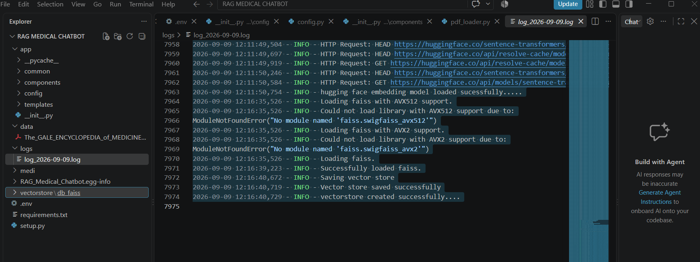

### Local MedAssist AI Interface


### Context-Grounded Medical Response

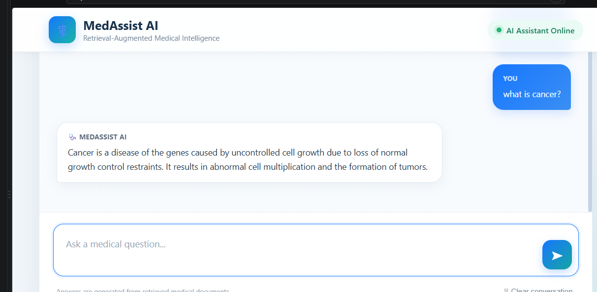

### Out-of-Context Guardrail

The chatbot avoids inventing an answer when the required information is not present in the supplied medical context.

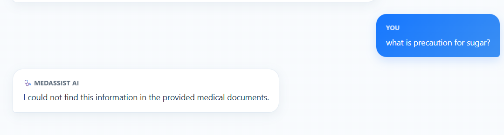

### Additional Medical Query


### FAISS & Flask Runtime Logs

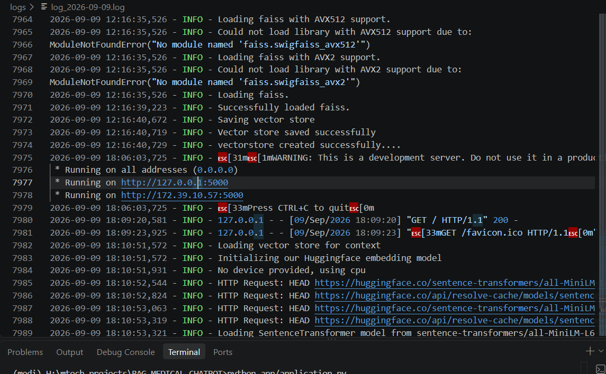

</details>

---

## 2️⃣ Docker Containerization

<details>
<summary><b>View Docker screenshot</b></summary>

### Docker Images


</details>

---

## 3️⃣ Jenkins CI Setup

<details>
<summary><b>View Jenkins screenshots</b></summary>

### Jenkins Initial Setup

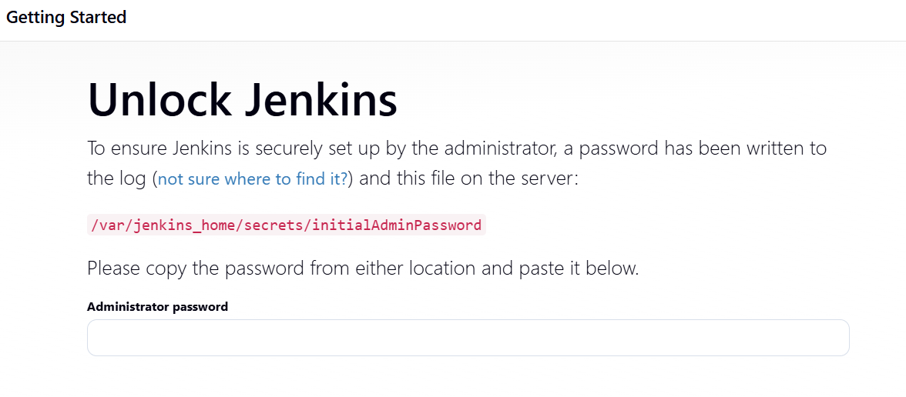

### Jenkins Plugin Installation

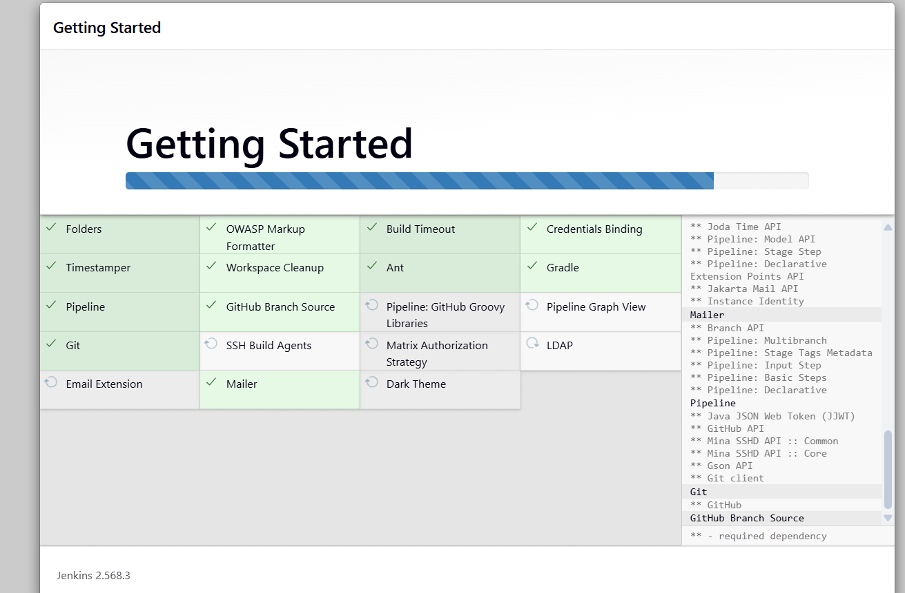

### GitHub Credential Configuration

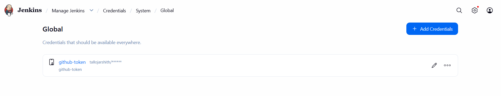

### Medical RAG Pipeline Job


### Successful GitHub Checkout

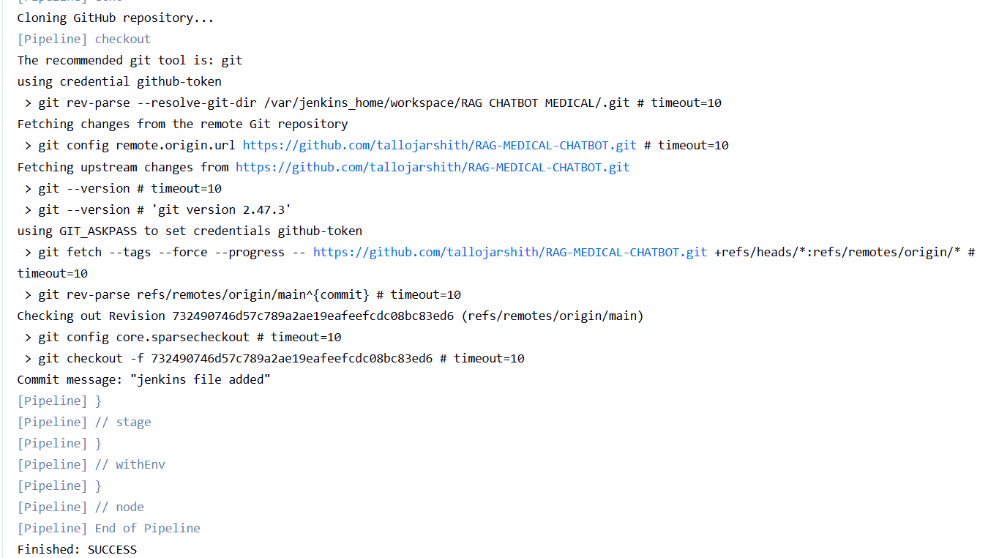

### Successful Jenkins Build

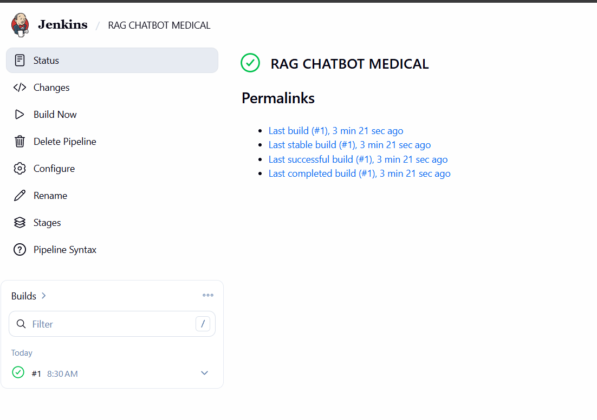

### Jenkins Workspace


### Jenkins Plugin Downloads

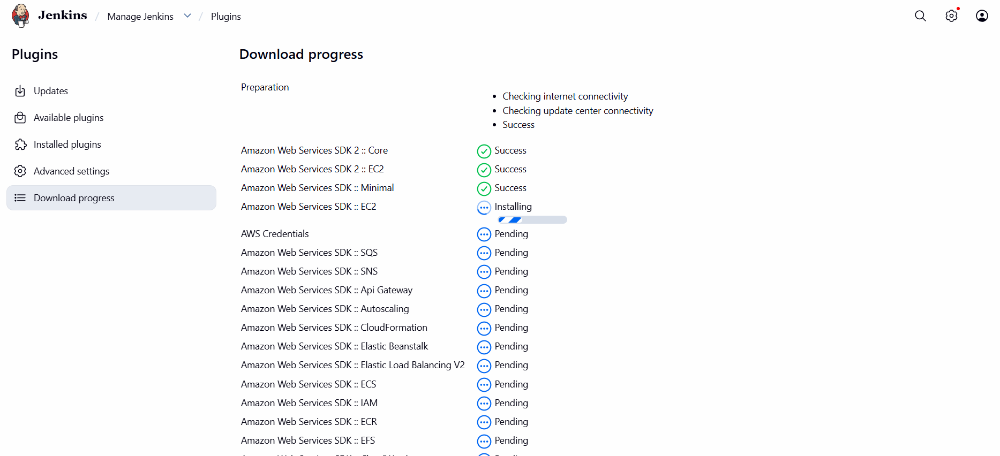

### Build & Dependency Logs

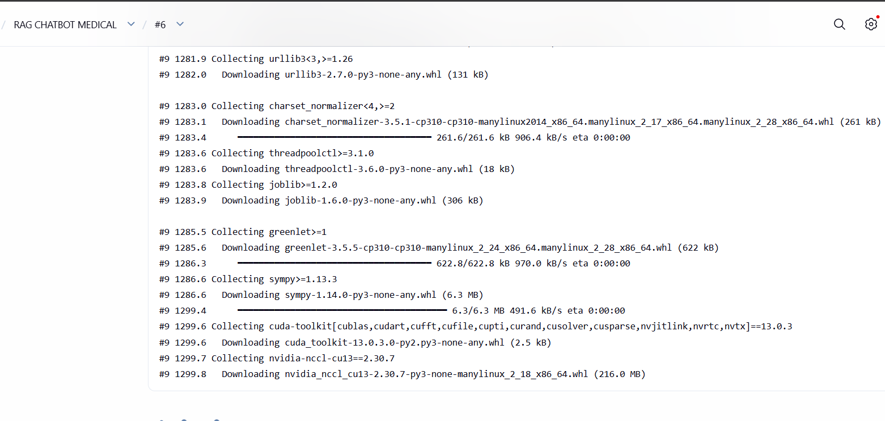

</details>

---

## 4️⃣ Amazon ECR & EC2 Deployment

<details>
<summary><b>View AWS deployment screenshots</b></summary>

### Docker Image Stored in Amazon ECR


### EC2 Pulling & Running Docker Image

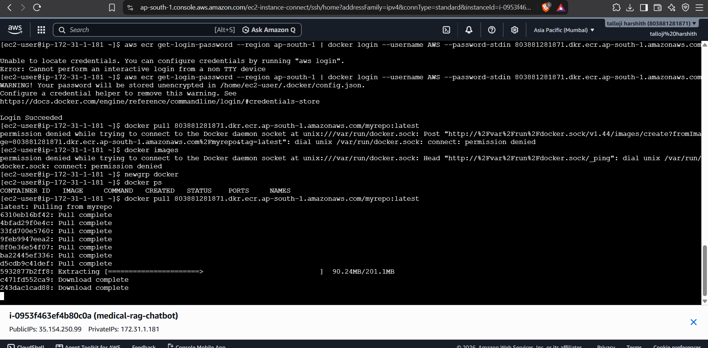

### Application Running on EC2

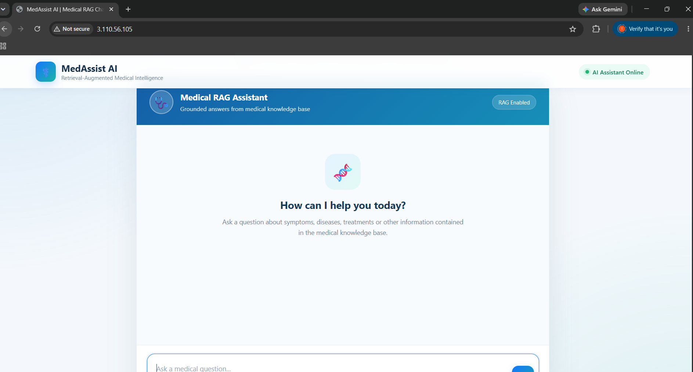

### Live Medical RAG Response

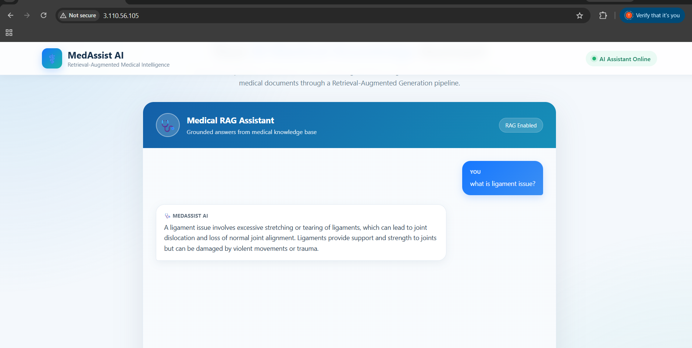

### Multiple Live Responses

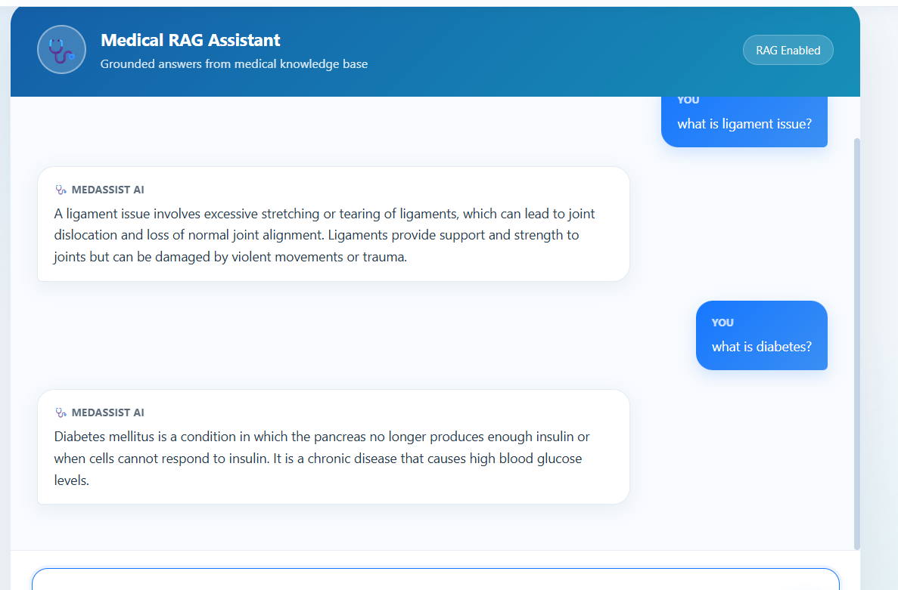

</details>

---

## 5️⃣ AWS Systems Manager & CD

<details>
<summary><b>View SSM deployment screenshots</b></summary>

### EC2 Registered as SSM Managed Node


### Jenkins → SSM → EC2 Deployment Success

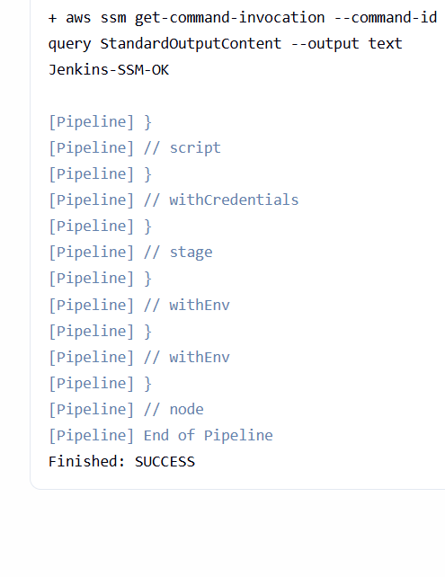

</details>

---

## 6️⃣ Final Live Medical RAG Chatbot

<details open>
<summary><b>View final deployed application</b></summary>

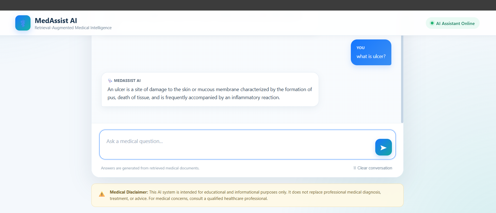

</details>

---

## 🛣️ Complete Project Journey

```text
Medical PDFs
     ↓
Document Processing
     ↓
Embeddings
     ↓
FAISS
     ↓
RAG Retrieval
     ↓
Qwen LLM
     ↓
Flask UI
     ↓
Docker
     ↓
Jenkins
     ↓
Trivy
     ↓
Amazon ECR
     ↓
AWS Systems Manager
     ↓
Amazon EC2
     ↓
Live Medical RAG Chatbot
```

---

# 🎯 Key Learning Outcomes

This project demonstrates practical experience with:

- Retrieval-Augmented Generation
- Document ingestion
- Text chunking
- Embedding models
- Semantic search
- Vector databases
- FAISS
- LangChain
- Hugging Face inference
- Large Language Models
- Prompt engineering
- Flask
- Docker
- Jenkins
- CI/CD
- Trivy
- AWS IAM
- Amazon ECR
- Amazon EC2
- AWS Systems Manager
- Linux
- Cloud networking
- Security groups
- Container deployment
- Cloud debugging

---

# 🚀 Future Improvements

Potential improvements include:

- Replace Flask's development server with **Gunicorn**.
- Configure a custom domain.
- Add **HTTPS/TLS**.
- Add health-check endpoints.
- Add automated unit and integration tests.
- Make selected Trivy vulnerabilities fail the pipeline.
- Add Prometheus and Grafana monitoring.
- Add source citations to chatbot responses.
- Introduce document reranking.
- Implement hybrid semantic + keyword search.
- Add RAG evaluation metrics.
- Add conversation-aware retrieval.
- Use immutable Docker image tags such as Git commit SHA instead of only `latest`.
- Add automated rollback if a deployment fails.
- Introduce blue-green or rolling deployment to reduce downtime.

---

# 💼 Interview Summary

A concise explanation of the project:

> I built an end-to-end Medical RAG chatbot that retrieves relevant information from medical PDFs using MiniLM embeddings and FAISS. The top relevant chunks are passed with the user's question to a Qwen instruction model through LangChain, and Flask provides the web interface. I containerized the application using Docker and built a Jenkins pipeline that scans the image with Trivy, pushes it to Amazon ECR, and deploys it to Amazon EC2 through AWS Systems Manager. I also implemented IAM-based access, runtime secret management, and restricted network access.

---

# ⚠️ Medical Disclaimer

This chatbot is an educational RAG application.

Generated responses:

- Should not be interpreted as medical diagnoses.
- Should not replace consultation with a qualified healthcare professional.
- Depend on the documents available in the knowledge base.
- May still contain errors despite retrieval grounding.

---

# 👨‍💻 Author

**Talloj Harshith**

M.Tech Data Science  
SVNIT Surat

---

# ⭐ Final Project Flow

```text
Medical Documents
       ↓
RAG Pipeline
       ↓
FAISS Retrieval
       ↓
Qwen LLM
       ↓
Flask Application
       ↓
Docker
       ↓
Jenkins
       ↓
Trivy
       ↓
Amazon ECR
       ↓
AWS Systems Manager
       ↓
Amazon EC2
       ↓
Live Medical RAG Chatbot
```

---

⭐ If you found this project useful, consider starring the repository.